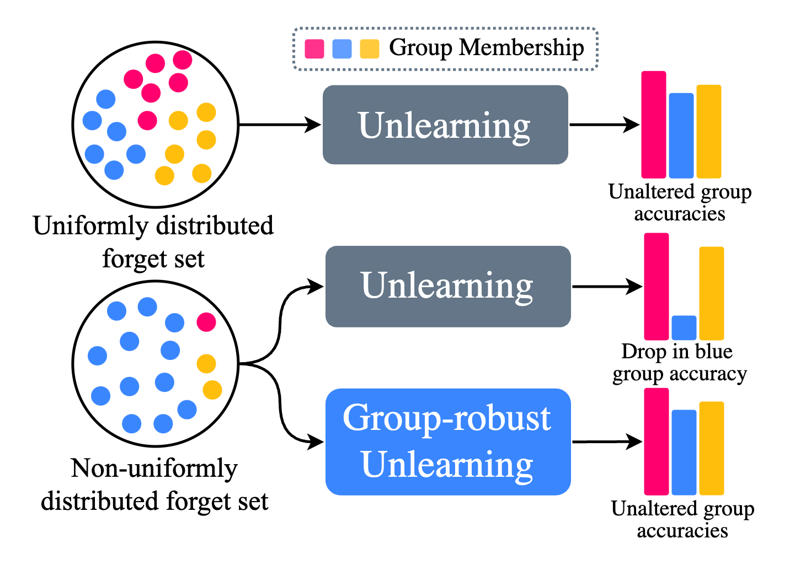

<h1 align="center">
Group-robust Machine Unlearning</br>(TMLR 2025)
</h1>

<div align="center">

#### [Thomas De Min](https://scholar.google.com/citations?user=fnh_i0cAAAAJ&hl=en), [Subhankar Roy](https://scholar.google.it/citations?user=YfzgrDYAAAAJ&hl=en), [Stéphane Lathuilière](https://scholar.google.fr/citations?user=xllguWMAAAAJ&hl=fr), </br>[Elisa Ricci](https://scholar.google.com/citations?user=xf1T870AAAAJ&hl=it&authuser=1), and [Massimiliano Mancini](https://scholar.google.com/citations?hl=it&authuser=1&user=bqTPA8kAAAAJ)

[](https://arxiv.org/abs/2503.09330)

<p align="center">
  
</p>

</div>

> **Abstract.** 
*Machine unlearning is an emerging paradigm to remove the influence of specific training data (i.e., the forget set) from a model while preserving its knowledge of the rest of the data (i.e., the retain set). Previous approaches assume the forget data to be uniformly distributed from all training datapoints. However, if the data to unlearn is dominant in one group, we empirically show that performance for this group degrades, leading to fairness issues. This work tackles the overlooked problem of non-uniformly distributed forget sets, which we call group-robust machine unlearning, by presenting a simple, effective strategy that mitigates the performance loss in dominant groups via sample distribution reweighting. Moreover, we present MIU (Mutual Information-aware Machine Unlearning), the first approach for group robustness in approximate machine unlearning. MIU minimizes the mutual information between model features and group information, achieving unlearning while reducing performance degradation in the dominant group of the forget set. Additionally, MIU exploits sample distribution reweighting and mutual information calibration with the original model to preserve group robustness. We conduct experiments on three datasets and show that MIU outperforms standard methods, achieving unlearning without compromising model robustness.*

## Citation
```
@article{
  min2025,
  title={Group-robust Machine Unlearning},
  author={Thomas De Min and Subhankar Roy and St{\'e}phane Lathuili{\`e}re and Elisa Ricci and Massimiliano Mancini},
  journal={Transactions on Machine Learning Research},
  year={2025},
  url={https://openreview.net/forum?id=StSq7mpUVw},
  note={}
}
```

## Installation 
### Dependencies
We used [uv](https://docs.astral.sh/uv/) as a Python package and project manager.
You can install uv without sudo access by:
```bash
$ curl -LsSf https://astral.sh/uv/install.sh | sh
```
After installing it, run the following command to create the .venv:
```bash
$ uv venv
```
Then, activate the environment as usual:
```bash
$ source .venv/bin/activate
```
Finally, install the requirements:
```bash
$ uv sync --frozen
```

### Alternative installation
If you do not want to install uv and prefer using conda or plain pip, we `pip freeze` the requirements into `requirements.txt` and use `python=3.12.9`.

```bash
$ conda create -n grmu python=3.12.9
$ conda activate grmu
$ pip install -r requirements.txt
```

### Datasets
Use `--data_dir path/to/datasets/` when running our scripts to set the dataset root.
Our code will look for datasets inside the provided directory, expecting each dataset to be structured as follows:
```
celeba/
    ├── val/
    ├── img_align_celeba/
    ├── test/
    ├── train/
    ├── list_bbox_celeba.txt
    ├── list_attr_celeba.txt
    ├── list_eval_partition.csv
    ├── identity_CelebA.txt
    ├── ofile.csv
    ├── list_attr_celeba.csv
    ├── list_eval_partition.txt
    ├── split.py
    └── list_landmarks_align_celeba.txt
fairface/
    ├── val/
    ├── train/
    ├── fairface_label_train.csv
    ├── test.py
    └── fairface_label_val.csv
waterbird_complete95_forest2water2/
    ├── 157.Yellow_throated_Vireo/
    ├── 124.Le_Conte_Sparrow/
    ├── 093.Clark_Nutcracker/
    ├── 012.Yellow_headed_Blackbird/
    ...
    ├── 004.Groove_billed_Ani/
    ├── 184.Louisiana_Waterthrush/
    ├── 089.Hooded_Merganser/
    ├── 026.Bronzed_Cowbird/
    └── metadata.csv
multinli_1.0/
    ├── bert_features/
        ├── cached_train_bert-base-uncased_128_mnli
        ├── cached_dev_bert-base-uncased_128_mnli
        └── cached_dev_bert-base-uncased_128_mnli-mm    
    └── metadata_random.csv
```

## Run Experiments
Run each experiment using `python main.py` with different arguments. 
As different unlearning ratios result in different splits, we pretrain and retrain one set of models for each split.
We suggest training `pretrain` and `retrain` first and then unlearn.
Run `python main.py --help` for the full list of available arguments. 
Below we report a couple of scenarios.

### Pretrain
Model pre-training on CelebA for unlearning ratio 0.5:
```bash
$ python main.py --method pretrain --dataset celeba --unlearning_ratio 0.5
```

### Retrain
Model retraining on Waterbirds for unlearning ratio 0.1:
```bash
$ python main.py --method retrain --dataset waterbird --unlearning_ratio 0.1
```

### MIU
Unlearn using MIU on FairFace for an unlearning ratio 0.9:
```bash
$ python main.py --method miu --dataset fairface --unlearning_ratio 0.9
```

### SalUN 
Unlearn using SalUN on MultiNLI
```bash
$ python main.py --model bert --method salun --dataset multinli
```

### MIU - Multi Group
Unlearn using MIU on FairFace with 25 multiple groups:
```bash
$ python main.py --method miu --dataset fairface --multi_group 5
```
> For implementation purposes, we use `--multi_group 3` and `--multi_group 5` for referring to 9 and 25 group experiments.

### Supported Methods
- `SalUn`: `$ python main.py --method salun --dataset celeba --unlearning_ratio 0.5`
- `SCRUB`: `$ python main.py --method scrub --dataset celeba --unlearning_ratio 0.5`
- `L1-sparse`: `$ python main.py --method l1_sparse --dataset celeba --unlearning_ratio 0.5`

### REWEIGHT
Our sampling distribution reweighting is enabled by default on MIU. Add `--ablate_rw` flag when running `main.py` with MIU to disable it. Instead, to enable REWEIGHT on baselines and Retrain, add `--rob_approach target_reweight` when running `main.py`.


### Storing and Loading Checkpoints
Checkpoints are stored by default in `output/` while they are loaded by default from `checkpoints/`. We used this configuration to avoid overwriting "good" checkpoints. These two locations can be changed using the following arguments: `--store_dir path/to/checkpoints` and `--checkpoint_dir path/to/checkpoints`.


### Hyperparameters
We store per dataset, per task hyperparameters under `method/configs/config_files/`. `method/configs/config_files/fallback.yaml` is loaded when there is no configuration file for a specific method/dataset/task configuration.

## Acknowledgements
We acknowledge the CINECA award under the ISCRA initiative for the availability of high-performance computing resources and support. E.R. and M.M. are supported by the MUR PNRR project FAIR - Future AI Research (PE00000013), funded by NextGeneration EU. E.R. is also supported by the EU projects AI4TRUST (No.101070190) and ELIAS (No.01120237) and the PRIN project LEGO-AI (Prot.2020TA3K9N). T.D.M. is funded by NextGeneration EU. This work has been supported by the French National Research Agency (ANR) with the ANR-20-CE23-0027.

## Contacts
Please do not hesitate to file an issue or contact me at `thomas.demin@unitn.it` if you find errors or bugs or if you need further clarification. 
